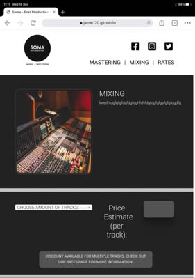
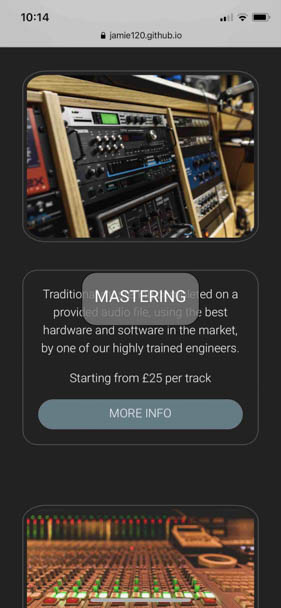
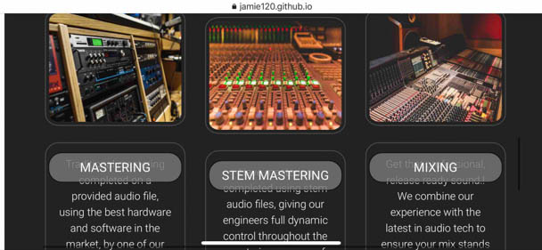
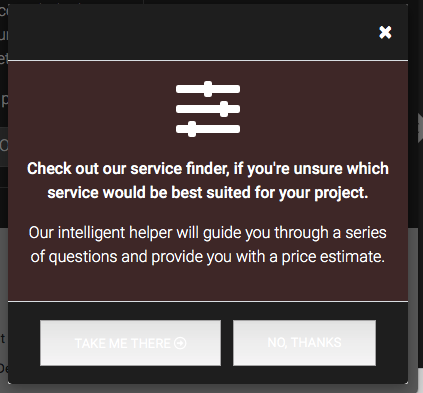

# Testing

[back to README.md](https://github.com/jamie120/MS2-Soma-Post-Production-Services/blob/master/README.md)

## Contents

1. [Manual Testing](#manual-testing)
    * [Home Page](#home-page)
    * [Contact Page](#contact-page)
    * [FAQ Page](#faq-page)
    * [Services Pages](#service-pages)
    * [Rates Page](#rates-page)
    * [Service Finder](#service-finder)
    * [Site Wide](#site-wide)
    * [Fixes required](#fixes-required)
2. [DevTools](#devtools)
3. [Automated Testing](#automated-testing)
    * [Code Validation](#code-validation)
    * [Browser Validation](#browser-validation)
4. [User Stories](#user-stories)
5. [User Testing](#user-testing)
    * [My Mentor](#my-mentor)
    * [User review](#user-review)
6. [Post Testing Changes](#post-review-changes)

## Manual Testing

### Testing completed using the following browsers: 

* Google Chrome (Version 87.0.4280.67) using MacOS on a monitor running at 1920 x 1080.
* Safari (Version 11.1.2 (13605.3.8)) using MacOS on a monitor running at 1920 x 1080.
* Apple iPad Pro 11" -  Safari and Google Chrome - latest build at 16/12/2020.
* Apple iPhone X - Safari and Google Chrome - latest build at 16/12/2020.

### **The following checks were completed on all browsers, any issues have been captured and documented below with screenshots.**

### **Home Page**
* Verify the page loads responsively on all device sizes. With desired elements displayed or hidden as required - :white_check_mark:
* Verify the carousel loads and images automatically scroll with corresponding text caption - :white_check_mark:
    
    

* Check all links on index.html take users to the correct pages - :white_check_mark:
* Check Modal opens from index.html after 5 seconds - :white_check_mark:

### **Contact Page**

* Verify email is received upon submitting a message using the contact form - :white_check_mark:
* Verify input field validation is working, to prevent a user submitting the form with empty fields - :white_check_mark:
* Verify that a new tab/mail client opens when the email icon is clicked - :white_check_mark:
* Verify all links on contact.html take users to the correct pages - :white_check_mark:

### **FAQ Page**

* Verify the page loads responsively on all device sizes. With desired elements displayed or hidden as required - :white_check_mark:
* Verify each answer is expandable using the provided icons - :white_check_mark:
* Verify icons change to minus once an answer is expanded and reverts back to plus once collapsed - :white_check_mark:
* Verify all links on faq.html take users to the correct pages - :white_check_mark:

### **Service Pages**

* Verify the page loads responsively on all device sizes. With desired elements displayed or hidden as required - :white_check_mark:
* Verify any images display as desired - :x:
    
    Issue identified on iPad and iPhone, where the service image appears stretched - note to fix added to revisions.

    

* Verify all text is clear and formatted correctly - :x:

    Issue identified on iPhone only - Select menu placeholder is not visible - note to fix added to revisions.

* Verify all JavaScript is working by ensuring prices update for all iterations of the select menu - :white_check_mark:
* Verify all links take users to the correct pages - :white_check_mark:

### **Rates Page**

* Verify the page loads responsively on all device sizes. With desired elements displayed or hidden as required - :white_check_mark:
* Verify all JavaScript is working by ensuring the correct rates table is displayed based on selection in the select menu - :white_check_mark:
* Verify all links take users to the correct pages - :white_check_mark:

### **Service Finder**

* Verify the page loads responsively on all device sizes. With desired elements displayed or hidden as required - :white_check_mark:
* Verify all JavaScript is working correctly by conducting user story tests to reach all possible outcomes:
    * Timed Mastering - :white_check_mark:
    * Stem Mastering - :white_check_mark:
    * Standard Mastering - :white_check_mark:
    * Mixing Service - :white_check_mark:
* Verify all calculations are correct, according to the rates - :white_check_mark:
* Verify calculate button revises to 'recalculate' once clicked - :white_check_mark:
* Verify all links take users to the correct pages - :white_check_mark:
* Verify the reset button works at any point - :white_check_mark:
* Verify a modal appears if the reset button is clicked - :white_check_mark:

### **Site Wide**

* Check navar is collapsed on iPhone -  :white_check_mark:
* Verify email is received upon signing up to the mailing list using the subscribe button on the footer - :white_check_mark:
* Verify email is received upon signing up to the mailing list using the top nav modal link - :white_check_mark:
* Verify social icon links on the footer and navigation banner direct the user to the relevant social service - :white_check_mark:
* Check elements appear on all pages correctly across all browsers - :x:

    In both Safari and Chrome, the service title overlays the text iPhone and in portrait on iPad - note to fix added to revisions.

    
    

    Modal style on Safari MacOS button style not as desired - note to fix in future versions.

    

    

### Fixes required 

Service pages - 
* Issue identified on iPad and iPhone, where the service image appears stretched.
* Issue identified on iPhone only - Select menu placeholder is not visible 

index.html - 
* In both Safari and Chrome, the service title overlays the text. This occurs on both iPad and iPhone.
* Modal button style not as desired on MacOS - Safari Browser

# DevTools

Google DevTools was used inside Google Chrome on MacOS throughout the development process. 

* Testing responsiveness of the site across several device models. 
    * Media queries written accordingly to better support popular devices such as iPad.

* Target elements and style with CSS, to test potential changes prior to coding them into relevant HTML.

* Console used to support development of JavaScript code.
    * console.log used at various points to check values of variables and function outputs, whilst developing logic for site.
    * Upon site completion - the console was checked for any errors
    * Console was used to check the status of Emailjs - to ensure requests were being sent to the server.
    * Once the site was completed, the console was checked for any errors on each page :white_check_mark:

# Automated Testing

## Validating the HTML, CSS and JS code

All of my code passed the following validation tests/services:
- HTML: [W3C Markup Validation Service](https://validator.w3.org/)
- CSS: [W3C Markup Validation Service](https://jigsaw.w3.org/css-validator/)
- JS: [jshint](https://jshint.com/)

* There were various HTML and CSS validation issues to resolve. These mainly referred to formatting my code and were easily fixable across the site.
* JS Validation highlighted the need the service-helper code to be parsed through Babel with the template literal plugin. This enables the code to be compatible with IE 11. 
* Various missing semicolons, unnecessary semicolons and various formatting errors were also highlighted. All have been resolved as required.

# User Stories

#### User Story 1
##### As a visitor to the site, I want to easily identify the business offer/purpose and be able to easily navigate the site to learn more if desired.
* Upon visiting the site, it is clear that the business offers audio services. 
* There is a navbar at the top of the page which clearly directs me to key pages.
* There are also several links at the top of each page, which allows me to reach a contact page, FAQ page and join a mailing list.

#### User Story 2
##### As a visitor to the site, I want to learn more about the services offered and listen to some of the work previously completed by the business.
* The home page indicates to me as a user, there are three main services offered - indicated by three elements at the bottom part of this page - and the main navbar.
* By clicking on one of these elements, I am taken to a main page relating to that selected service. On this page there are several audio examples, which play within the browser. 

#### User Story 3
##### As a potential client, I know what service I require and would like to see the business rates.
* Upon vising the site, I can see one of the main three links in the navbar is 'RATES'.
* On the rates page, I'm not overwhelmed with unnecessary information - the rates page allows me to select only the service I wish to see prices for.

#### User Story 4
##### As a potential client, I want to speak to somebody at the company to discuss a more bespoke service.
* I am able to vising the contact us page to leave a message to request a call-back. 
* I can call the business directly, there is a phone number available on the contact us page.
* Upon visiting the FAQ, this question has a response and encourages me to call.

#### User Story 5
##### As a potential client, I'm not sure which service would benefit my project the most. I need some support finding the right one.
* Whilst browsing the site, I had come across a feature called 'service-finder' I can get to this from the home page(index.html) and each of the services pages.
* A pop-up appeared after a few seconds on the home page (index.html). This appears to take me to an interactive app, the service finder. It was able to identify exactly what service I need.

# User Testing

## My-Mentor

A series of feedback and suggestions had been highlighted during the second call on Friday 18th December 2020. Action has been taken for all of these suggestions and changes to the site and code. 

All changes are documented in Section 11 (Post Testing Fixes) in the main README file. Found [here](https://github.com/jamie120/MS2-Soma-Post-Production-Services/blob/master/README.md) 

## User Testing

A fellow Code Institure student took the time to thoroughly review the site content and code. They provided me with several ideas to improve both the user experience and improve the code efficiency.

All changes made have been documented in Section 11 (Post Testing Fixes) in the main README file. Found [here](https://github.com/jamie120/MS2-Soma-Post-Production-Services/blob/master/README.md) 

# Post Review Changes

* The following was addressed post testing and feedback. (changes are detailed in commit history dated 20/12/2020 onwards) :
    
    1. Carousel width expanded to occupy majority of viewport.
    2. Home link added to navbar.
    3. Services drop down links added to navbar - to contain 'mastering', 'stem-mastering' and 'mixing'.
    4. Remove 'mastering-landing' page from the site - this is no longer required with expanded service links into navbar.
    5. Contact and FAQ links - added to navbar. Removed from top-nav links.
    6. Nav-bar and top-links fixed to the top of site.
    7. index.html - Info added to section containing the service finder link - to assist users better understand its purpose.
    8. Service Finder.
        
        * Bring labels closer to select menus.
        * Remove buttons which contain links to service pages. Replace with paragraphs and remove button style.
        * Move reset button alongside calculate button, when both elements are present on the screen.
        * Remove border and background style on initial question and corresponding content within its element.
        * Address responsive design, to increase user experience on smaller devices - adjusting padding, margin and order to support changes.

    9. Service Pages.

        * Price Estimate section - Move text 'price estimate' to become a section header.
        * Remove service finder link from service page - no longer required.

    10. Rates Page - Display a table as default when the user visits the page. (Standard Mastering Table set as default)

    10. Add favicon to site - which will add a small icon next to the url within users browsers.  

    11. CSS Style Sheet.
        
        * Reduce code, by removing duplicate entries.
        * Combine media queries where possible to reduce code.
        * Use shorthand padding and margin where possible, to reduce lines of code where possible.  

    12. JavaScript.

        * Add additional, more expressive notes / documentation to JS files.
        * Create const's where possible to reduce repeat code and tidy up code blocks.

    13. File Structure.
        * Remove .gitpod.dockerfile, .gitpod.yml, -r .theia files from repo.
        * Move html pages into newly created pages dir, apart from index.html.
    